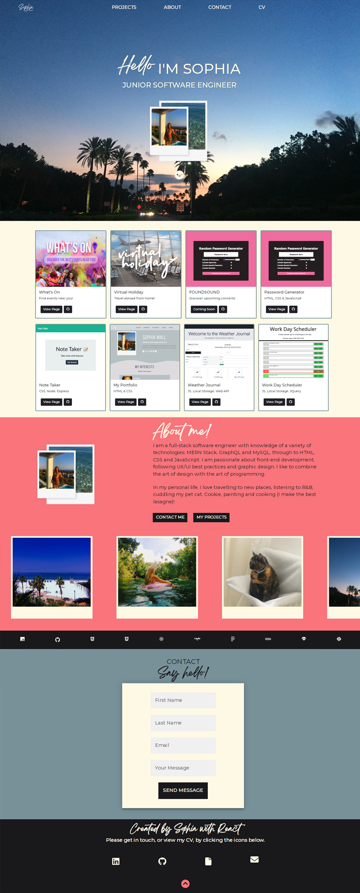
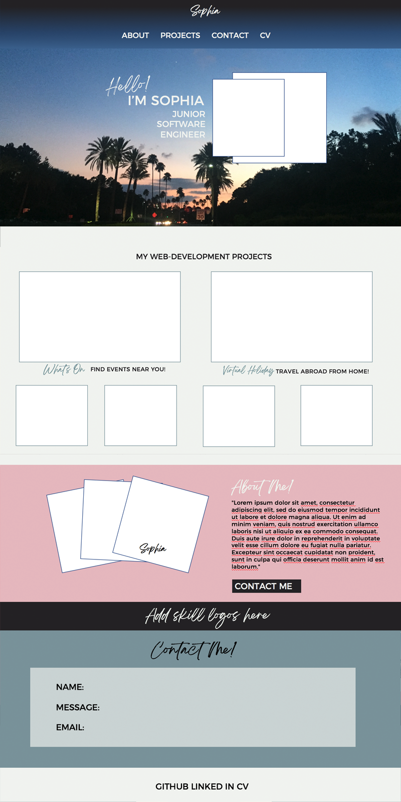

# My Portfolio - Made with React.JS

My updated portfolio featuring a nav bar, hero, project cards, about me, contact form and footer.

# Deployed Page

[View here](https://sophia4422.github.io/my-react-portfolio/)

# Technologies and Packages

- React
- React Router Dom
- Email JS
- Node
- Github Pages
- CSS
- React Bootstrap
- React Scroll
- FontAwesome

# Screenshots

This is the final webpage:



# UX/UI Design

The original plan of the portfolio was designed with Figma. As I was building, the design and colours altered in my progress. Whilst I have stuck to a similar layout, I like the final outcome much more.



# User Story

```
AS AN employer looking for candidates with experience building single-page applications
I WANT to view a potential employee's deployed React portfolio of work samples
SO THAT I can assess whether they're a good candidate for an open position
```

# Contact

-[My LinkedIn](https://www.linkedin.com/in/sophia-wall/)

-[My GitHub](https://github.com/sophia4422)

-Email: sophiapwall@yahoo.co.uk
